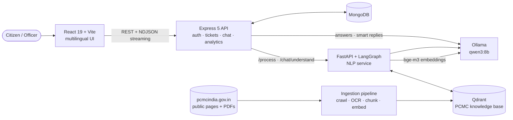
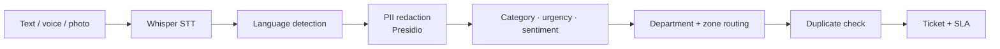
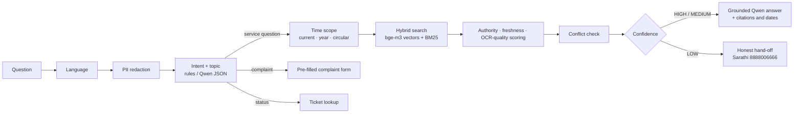

<div align="center">

# 🏙️ PCMC Civic

### AI-powered complaint management and multilingual citizen assistant for Pimpri-Chinchwad Municipal Corporation

Report civic problems in **English, हिंदी, मराठी or Hinglish**, by text or voice. AI classifies and routes each one to the right department and zone. A chatbot answers questions about PCMC services from official PCMC sources.


</div>

---

## 📑 Contents
- [Why](#-why)
- [Features](#-features)
- [Architecture](#-architecture)
- [How the chatbot stays accurate](#-how-the-chatbot-stays-accurate)
- [Tech stack](#-tech-stack)
- [Getting started](#-getting-started)
- [Building the knowledge base](#-building-the-knowledge-base)
- [Project structure](#-project-structure)
- [Evaluation](#-evaluation)
- [Privacy and responsible data use](#-privacy-and-responsible-data-use)
- [Roadmap](#-roadmap)

---

## 💡 Why
Pimpri-Chinchwad's civic information is spread across web pages, PDFs and scanned Marathi circulars, and complaints arrive in many languages and formats. PCMC Civic does two jobs:

1. **For citizens:** report a problem in your own language and track it with a ticket number, or ask the assistant how to get a service done.
2. **For officers:** get complaints already classified, prioritised and routed, with AI-drafted replies and management analytics.

---

## ✨ Features

### 👥 For citizens
| | |
|---|---|
| 📝 **Report by text, voice or photo** | Speech-to-text with Whisper. Photos are attached to the complaint. |
| 🌐 **Four languages** | English, Hindi, Marathi and Hinglish, detected automatically. The UI is fully translated. |
| 🎫 **Ticket tracking** | `PCMC-100001`-style tickets. Status lookup needs both the ticket number and your email. |
| 🤖 **Citizen assistant** | Answers about property tax, water connections, certificates, building permission, zones, CFCs and more, with sources and dates. |
| ➡️ **Chat → complaint** | When you describe a problem in chat, the assistant pre-fills the complaint form for you. |
| 🧹 **Remove my data** | From the Track page a citizen can have their name, email, photo, exact address and original wording removed from all their complaints. |

### 🏛️ For PCMC officers
| | |
|---|---|
| 🧠 **Automatic triage** | Category (local Qwen, checked against zero-shot XLM-R), urgency (P1–P4), sentiment, department and zone routing. |
| 🔁 **Duplicate detection** | bge-m3 meaning similarity plus map distance (same category, open, last 7 days). One click merges a duplicate into the original and counts the citizen as affected. |
| 👷 **Field staff** | Named field workers per department and zone, assignment from the ticket or in bulk, workload counts and private internal notes. |
| ⏱️ **SLA tracking** | Deadlines per priority, from the shared `config/pcmc.json`. |
| ✍️ **AI-drafted replies** | Streamed, regenerable replies in the citizen's language from local Qwen. Complaints are translated for officers. |
| 🗺️ **Map and analytics** | Zone hotspots, trends, ageing, department performance and chatbot usage. |
| 🔐 **Role-based access** | JWT auth. Officers see only their own department's queue. |
| 🛡️ **Account security** | Strong-password rule, change password (old sessions are signed out), lockout after 5 wrong passwords, 30-minute idle logout and an admin activity log. |
| 🔄 **Weekly knowledge refresh** | PCMC's website is re-read every week at night. New, changed and removed pages are listed on the Knowledge base page for review. |

---

## 🏗️ Architecture



### Complaint pipeline


### Chatbot pipeline


---

## 🎯 How the chatbot stays accurate
> **Qwen doesn't decide what's true.** Retrieval decides which source is authoritative and current, and Qwen answers only from that evidence.

- **Official sources only:** 577 public PCMC documents, including 154 citizen charters with time limits, fees and required documents, plus department pages, ward/zone data, CFC lists and policies.
- **Authority levels:** hand-verified entries rank first, then official PCMC pages and documents, then supporting disclosures.
- **Time-aware:** the bot recognises *"current rules"* versus *"the 2023 circular"*. Superseded documents are kept for history but filtered out of "current" answers.
- **OCR-aware:** most PCMC PDFs use legacy Marathi fonts, so they're OCR'd with Tesseract (`mar+hin+eng`). Scanned sources are labelled, and their confidence is reduced.
- **Conflict detection:** different fees or time limits in two versions of the same service trigger a "please verify" answer instead of a guess.
- **Safety checks:** phone numbers that aren't in the sources are removed. Answers in the wrong script are blocked. Out-of-scope questions get a clear refusal.
- **Citations:** every answer lists its sources, with *dated*, *scanned* and *checked* labels.

---

## 🧰 Tech stack
| Layer | Technology |
|---|---|
| **Frontend** | React 19, Vite, React Router 7, react-i18next, Recharts, React-Leaflet, lucide-react |
| **Backend** | Node.js, Express 5, Mongoose 9, JWT, Multer, Nodemailer, Cloudinary |
| **NLP service** | FastAPI, LangGraph, Presidio, langdetect, Hugging Face Transformers (zero-shot XLM-RoBERTa), Whisper |
| **LLM** | Ollama: `qwen3:8b` for answers, replies and intent, `bge-m3` for multilingual embeddings |
| **Knowledge base** | Polite crawler (httpx), BeautifulSoup, trafilatura, PyMuPDF, Tesseract OCR, Qdrant (embedded), BM25 |
| **Data** | MongoDB, shared `config/pcmc.json` for zones, wards, departments, routing and SLAs |

---

## 🚀 Getting started

### Option A: Docker (one command)
Needs Docker Desktop. An NVIDIA GPU is optional (remove the `deploy` block in `docker-compose.yml` without one).

```bash
cp .env.docker.example .env      # set JWT_SECRET and INTERNAL_API_TOKEN
docker compose up -d --build
```

Open **http://localhost:8080**. The first start downloads `qwen3:8b` and `bge-m3` (about 6 GB) and builds a large NLP image. Put an existing knowledge base in `nlp/data/` or build it as described below. Create an officer with:

```bash
docker compose exec backend node scripts/create_officer.js <email> <password> "<name>" admin
```

### Option B: Run locally

#### Prerequisites
- **Node.js** 20+, **Python** 3.12+, **MongoDB**
- **[Ollama](https://ollama.com)**. An 8 GB GPU is enough for `qwen3:8b` plus `bge-m3`.
- **Tesseract OCR** with Marathi and Hindi, needed only to build the knowledge base.

#### 1. Pull the models
```bash
ollama pull qwen3:8b
ollama pull bge-m3
```

#### 2. Install
```bash
git clone https://github.com/abhisheknanaware/pcmc-civic-ai.git
cd pcmc-civic-ai

cd backend  && npm install && cp .env.example .env   # fill in MONGO_URI, JWT_SECRET, ...
cd ../frontend && npm install
cd ../nlp   && python -m venv venv
venv/Scripts/pip install -r requirements.txt          # macOS/Linux: venv/bin/pip
cp .env.example .env
```

#### 3. Run
Start the services in this order. The backend warms up the model when it starts, so Ollama must already be running.

| # | Service | Command | Port |
|---|---|---|---|
| 1 | Ollama | `ollama serve` | 11434 |
| 2 | NLP service | `cd nlp && venv/Scripts/python pipeline.py` | 8000 |
| 3 | Frontend | `cd frontend && npm run dev` | 5173 |
| 4 | Backend | `cd backend && npm start` | 5000 |

Then open **http://localhost:5173**.

#### 4. Create an officer account
```bash
node backend/scripts/create_officer.js <email> <password> "<name>" [admin|agent] ["<department>"]
```
Passwords need at least 10 characters with letters and numbers.

---

## 📚 Building the knowledge base
The crawled data isn't committed. Rebuild it from the `nlp` folder:

```bash
python -m ingest.crawler           # polite crawl of public PCMC pages (robots.txt, 1 request / 2 s)
python -m ingest.extract --ocr     # HTML + PDF extraction, parallel Tesseract OCR with caching
python -m ingest.translate_titles  # English search titles for Marathi documents (search only)
python -m ingest.chunk             # structure-aware chunks with full provenance metadata
python -m ingest.index             # bge-m3 embeddings -> local Qdrant (only changed chunks)
python -m ingest.report            # inventory.md / inventory.csv for human review
```

Then reload the running service with `curl -X POST http://localhost:8000/kb/reload`. Crawl rules and document fields are described in [`nlp/ingest/README.md`](nlp/ingest/README.md).

### Weekly refresh
The NLP service runs all of the steps above once a week (`python -m ingest.refresh`) in a night window, then reloads the chatbot. Pages fetched in the last 7 days are skipped and only changed chunks are re-embedded. If a step fails, the chatbot keeps the previous index. The result (`data/crawl/refresh_report.json`) lists new, changed and removed documents, and admins can review them or start a refresh from the Knowledge base page.

| Setting (`nlp/.env`) | Default | |
|---|---|---|
| `KB_REFRESH_DAYS` | `7` | `0` turns the automatic refresh off |
| `KB_REFRESH_HOUR` | `2` | start of the 3-hour night window (local time) |

---

## 🗂️ Project structure
```
pcmc-civic-ai/
├── config/pcmc.json        # zones, wards, departments, routing, SLAs (single source of truth)
├── backend/                # Express API: auth, complaints, tickets, chat, analytics, meta
│   ├── controllers/  models/  routes/  services/  middleware/
│   └── scripts/create_officer.js
├── frontend/               # React app: home, report, track, chat widget, officer dashboard
│   └── src/  pages/  components/  locales/ (en · hi · mr)
└── nlp/                    # FastAPI + LangGraph service
    ├── pipeline.py         # /process, /chat/understand, /kb/*
    ├── chat/               # chat graph, hybrid retriever, embeddings
    ├── ingest/             # crawler, extraction + OCR, chunking, indexing
    ├── preprocessing/  classification/  urgency/  sentiment/  routing/  speech/
    ├── knowledge/          # hand-verified PCMC knowledge entries
    └── eval/               # chatbot and retrieval evaluations
```

---

## 📊 Evaluation
| Test | Result |
|---|---|
| Chat intent detection (44 cases) | 42 / 44 |
| Topic detection | 32 / 33 |
| Right source in top 3 (20 questions in EN / MR / Hinglish) | 19 / 20 |
| Out-of-scope questions refused | 3 / 3 |
| Retrieval latency | ~0.4 s |
| Complaint category, 98 labelled complaints (EN / HI / MR / Hinglish) | 96 / 98 with Qwen (zero-shot XLM-R alone: 47 / 98) |

```bash
cd nlp
venv/Scripts/python eval/chat_eval.py   # intent / topic / answer grounding
venv/Scripts/python eval/kb_eval.py     # hybrid retrieval quality and latency
venv/Scripts/python eval/classify_eval.py  # complaint category accuracy
```

---

## 🔒 Privacy and responsible data use
- **PII redaction:** personal data is redacted before any LLM call. Chat sessions are stored redacted and expire after 30 days.
- **Automatic retention:** complaints closed more than `RETENTION_DAYS` (default 365) ago are anonymised every day. Name, email, photo, exact address and original wording are removed. Category, zone, dates and the redacted text stay for statistics.
- **Right to erasure:** citizens can remove their personal data from the Track page (ticket number + email). Open issues stay in the queue so they still get fixed.
- **Activity log:** officer sign-ins, ticket changes, merges, knowledge-base edits and data deletions are logged for one year.
- **Secrets stay local:** keys live only in `.env` files, which are git-ignored. Use the `.env.example` templates.
- **No citizen data in the repo:** uploads, crawled data, the OCR cache and the vector index are excluded.
- **Polite, public-only crawling:** the crawler fetches only public pages, respects `robots.txt` and never logs in. PCMC staff orders that name employees are filtered out.
- **Not an official service:** answers point citizens to official PCMC sources and the **Sarathi helpline 8888006666** for confirmation.

---

## 🛣️ Roadmap
- [x] Officer knowledge-base admin page: approve, disable or mark superseded, and review unanswered questions
- [x] Weekly re-crawl with change alerts
- [ ] Larger evaluation set (~150 questions, including time-scope and conflict cases)
- [ ] Official locality → ward mapping from PCMC
- [ ] SMS / WhatsApp notifications and P1 emergency dispatch

---

<div align="center">

Built for the citizens of **Pimpri-Chinchwad** 🧡

</div>
